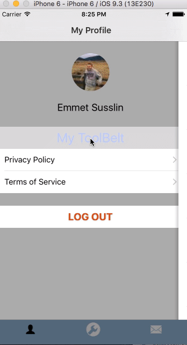
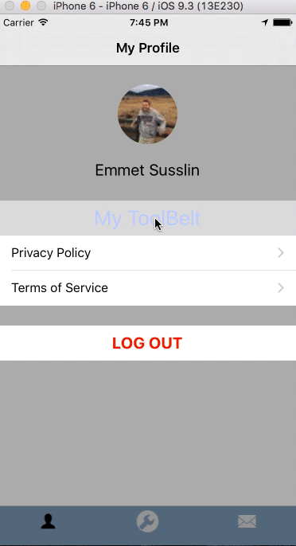
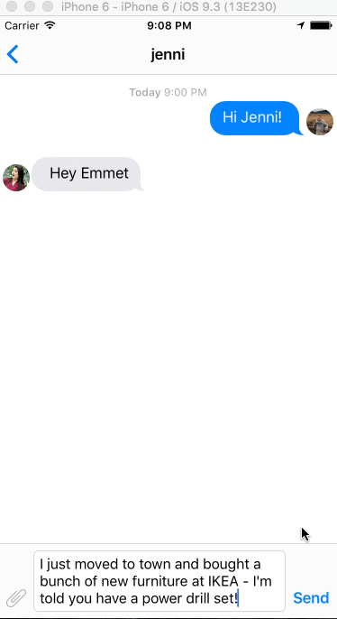

## Tool_Belt

Tool_Belt is the latest contribution to the peer-to-peer sharing economy.  Tool_Belt enables users to share and borrow common household tools with their neighbors.  It is said that the average use of a common household tool is only 30 minutes across a tool's lifetime - most common tools are necessary for specific projects but hardly needed thereafter.  This makes common tools a natural resource to share rather than purchase for specific household projects.

Like other popular sharing economy mobile apps such as Uber and Lyft, ToolBelt provides users with the ability to share tools from their peers nearby, combining the user's geographic location on a map with nearby available tools for them to seek out and borrow.

Whether folks need a tool for a unique undertakings such as a grass seed spreader for seeding a new lawn, or common tools as basic as a hammer for assembling a new bedframe Tool_Belt provides users with the option to lend and borrow tools from their neighbors on an as-needed basis.  

# Stack

Tool_Belt is a native iOS mobile application built in Swift 2.3.  

Tool_Belt uses [Backendless](https://www.google.com) of its backend (MBaaS).  This app was originally built with a Rails API for a backend, which was a bit overkill and less than ideal for an agile mobile application.  Backendless provides user security, supports the simply one-to-many relationship between users and tools on their 'ToolBelt' as well as Geolocation services for location-based tool searching.  

Tool_Belt also provides users with the ability to chat directly with each other to make tool-borrowing arrangements via direct personal messages hosted by [Firebase](https://firebase.google.com/).

# Login

Tool_Belt user accounts can be created from scratch and users can also be authenticated via a Facebook login.  It is important that all users have a profile picture to use the app - Tool_Belt will automatically use a facebook profile picture if the user doesn't set an avatar personally.

Profile pictures greatly enhance the user experience with a sharing economy app like Tool_Belt.  Being able to put a name and a face to neighbors from whom a user is borrowing or lending tools is tantamount to the success of the application, as such the user's profile picture is available throughout the UX design of the application.

# Searching for tools and messaging other users

Once logged in the user has access to his profile page (lower left tab), his personal messages (lower right) and the map searching feature to search for tools nearby via a simple word search. Here is a demonstration of myself logging in via Facebook and searching for a pressure washer - a typical household tool often needed for single-use projects, such as treating a weathered wooded deck or garage floor.

I used a [Mapbox](https://www.mapbox.com/) to create a custom map experience for the user that is removed from the redundant UX of Apple maps.  For a geolocation sharing economy app I believe is this tantamount as the user feels like his immediate tool-oriented needs at his location is being uniquely serviced much like other marquee sharing economy applications.

Tool_Belt hosts personal messaging between users so they can arrange to exchange tools on their own terms without revealing or exchanging personal contact information.  

The tool images also greatly enhance the user experience.  Often times a user might need a tool of a certain demension which might not turn up in a simple text search.  The tool photos, just like the user profile pics make finding the tool you need as efficient as possible.  Beyond the images and description of the tools, the personal messaging between users provides the chance to seek additional specifications of the tools as needed.

In addition to the map searching interface, tools can be browsed in table format as well.

# Listing tools via My ToolBelt

Users are encouraged to contribute to the Tool_Belt commmunity by listing their tools for others in the community to use.  Users can list their own tools for lending via the 'My ToolBelt' feature accessible via the user profile page.

When listing a tool users can provide the brand of the tool (as necessary) as well as general specifics of the tool to best inform potential borrowers.  Just as the profile pictures are necessary to enhance the user experience, pictures of the tools are required to list a tool on the app.  Additionally, an address is required to list a tool.  The applications Geolocation for searching tools looks for the location of the tools themselves rather than the tool owner's given location.  This enables a user to list tools at various locations - one's home as well as one's shop or studio if the tool resides and is available from another location(s).

Once tools are listed on in the 'My ToolBelt' page a user can elect to make the tools available or unavailable as the status of a tool's availability changes.

Whether users live in rural areas, suburban areas or more dense areas like Brooklyn, NY (featured below) Tool_Belt provides users with the ability to quickly borrow common household tools from the community near them saving money and time.

# Next

There are a number of improvements small and large that remain on deck for this application.  Broadly, for this application to go live on the App Store the legality of a peer-to-peer shared ecomony application involing power tools will need to be sorted out (likely in the form of an LLC).  Beyond that significant detail, users will need an incentive to list their personal tools on the application for relative strangers to use, much like drivers for Uber and Lyft are incentivised financially to provide rides to other users.  

On a technical level there are countless minor UX improvements that could be made, including but not limited to notifications for personal messages and tool availability 'listeners' wherein users can set up a list of conditions in which they'd like to borrow a tool and will recieve a notification when such a tool becomes available nearby.

Ultimately for this application to be successful several quality control features will need to be introduced such as the ability of a user to rate their experience borrowing tools from other users and lending out their own tools.  It will be vital to the success of this application that users are guaranteed only the best experience borrowing tools from their peers.

