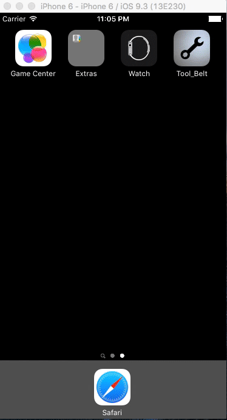

## Tool_Belt

Tool_Belt is the latest contribution to the peer-to-peer sharing economy.  Tool_Belt enables users to share and borrow common household tools with their neighbors.  It is said that the average use of a common household tool is only 30 minutes across a tool's lifetime - most common tools are necessary for specific projects but hardly needed thereafter.  This makes common tools a natural resource to share rather than purchase for specific household projects.

Whether folks need a tool for a unique undertakings such as a grass seed spreader for seeding a new lawn, or common tools as basic as a hammer for assembling a new bedframe Tool_Belt provides users with the option to lend and borrow tools from their neighbors on an as-needed basis.  

# Stack

Tool_Belt is a native iOS mobile application built in Swift 2.3.  

Tool_Belt uses [Backendless](https://www.google.com) of its backend (MBaaS).  This app was originally built with a Rails API for a backend, which was a bit overkill and less than ideal for an agile mobile application.  Backendless provides user security, supports the simply one-to-many relationship between users and tools on their 'ToolBelt' as well as Geolocation services for location-based tool searching.  

Tool_Belt also provides users with the ability to chat directly with each other to make tool-borrowing arrangements via direct personal messages hosted by [Firebase](https://firebase.google.com/).

# Login

Tool_Belt user accounts can be created from scratch and users can also be authenticated via a Facebook login.  It is important that all users have a profile picture to use the app - Tool_Belt will automatically use a facebook profile picture if the user doesn't set an avatar personally.

Profile pictures greatly enhance the user experience with a sharing economy app like Tool_Belt.  Being able to put a name and a face to neighbors from whom a user is borrowing or lending tools is tantamount to the success of the application, as such the user's profile picture is available throughout the UX design of the application.

# Searching for tools and messaging other users

Once logged in the user has access to his profile page (lower left tab), his personal messages (lower right) and the map searching feature to search for tools nearby via a simple word search. Here is a demonstration of myself logging in via Facebook and searching for a pressure washer - a typical household tool often needed for single-use projects, such as treating a weathered wooded deck or garage floor.

Tool_Belt hosts personal messaging between users so they can arrange to exchange tools on their own terms without revealing or exchanging personal contact information.  

The tool images also greatly enhance the user experience.  Often times a user might need a tool of a certain demension which might not turn up in a simple text search.  The tool photos, just like the user profile pics make finding the tool you need as efficient as possible.  Beyond the images and description of the tools, the personal messaging between users provides the chance to seek additional specifications of the tools as needed.

In addition to the map searching interface, tools can be browsed in table format as well.

